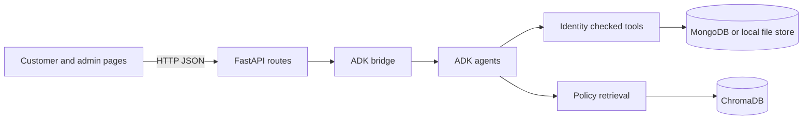

# AI Customer Support and Resolution Platform

SupportAI is a customer support app with a FastAPI API, Google ADK agent workflow, customer and admin browser apps, MongoDB storage, and Chroma based policy retrieval. The agents inspect verified customer/order data, apply policy, record requested actions, and hand cases to human support when needed.

## Architecture



The backend owns ticket IDs, ticket persistence, request idempotency, authentication, and action approval. The agent records escalation intent; it does not create or invent ticket references. Refunds and replacements for delivered orders go to human review.

## Design decisions

- MongoDB stores the customer-visible conversation transcript; the ADK session service separately stores agent state and event history. These stores serve different purposes.
- MongoDB is the ticket system of record. The agent records escalation intent, and the backend creates the ticket.
- Chroma is the embedded vector store, which avoids a separate vector service for local use.
- Gemini embeddings use the existing `google-genai` dependency rather than adding a second embedding library.

## Repository layout

```text
backend/                  FastAPI app, routes, data access, RAG, tests
final_customer_support/   ADK agents, action tools, sample data
frontend/customer/        Customer chat page
frontend/admin/           Admin console
frontend/shared/          Shared browser configuration
```

## Setup

Use Python 3.12. From the repository root:

```powershell
py -3.12 -m venv .venv
.\.venv\Scripts\Activate.ps1
python -m pip install -r backend/requirements.txt -r final_customer_support/requirements.txt
Copy-Item backend/.env.example backend/.env
```

Set the values needed for your environment in `backend/.env`. `JWT_SECRET` must be at least 32 characters and must not be a placeholder. Generate a value with:

```powershell
python -c "import secrets; print(secrets.token_urlsafe(48))"
```

The same variable names are listed in the root, backend, and ADK `.env.example` files.

| Variable | Purpose |
| --- | --- |
| `GOOGLE_API_KEY` | Gemini model and embedding access |
| `PROVIDER` | Model provider; defaults to `gemini` |
| `MODEL` | Primary model |
| `FALLBACK_MODEL` | Fallback model |
| `MONGODB_URI` | MongoDB URI; defaults to local MongoDB |
| `MONGODB_DB_NAME` | Database name |
| `JWT_SECRET` | Required signing key, minimum 32 characters |
| `JWT_EXPIRES_MINUTES` | Token lifetime |
| `CORS_ORIGINS` | Optional comma-separated browser origins |
| `MAX_OUTPUT_TOKENS` | Maximum generated response tokens |
| `LOGIN_RATE_LIMIT_ATTEMPTS` | Failed logins allowed per email and IP window |
| `LOGIN_RATE_LIMIT_WINDOW_SECONDS` | Per-email login limit window |
| `LOGIN_RATE_LIMIT_IP_ATTEMPTS` | Failed logins allowed across emails from one IP |
| `LOGIN_RATE_LIMIT_IP_WINDOW_SECONDS` | Per-IP login limit window |
| `SUPPORTAI_DATA_FILE` | Override for the local Mongo-compatible file store |
| `SUPPORTAI_FIXTURE_DIR` | Override for read-only customer/order/policy fixtures |
| `SUPPORTAI_RUNTIME_DIR` | Override for runtime actions and local data |

## Create an admin

Public registration only creates customer accounts. Create an administrator from the repository root:

```powershell
python -m backend.manage_admin create --email admin@example.com --password "UseAUniquePassword123!" --name "Support Admin"
```

Passwords must be at least 10 characters. Stop the API before running `manage_admin` when the local file-backed store is active.

## Run the API and browser apps

Start the API from the repository root:

```powershell
python -m uvicorn backend.main:app --reload --port 8000
```

OpenAPI docs are at `http://127.0.0.1:8000/docs`; the health check is `/health`.

In separate terminals, serve each static frontend:

```powershell
python -m http.server 3000 --directory frontend/customer
python -m http.server 3001 --directory frontend/admin
```

Open `http://127.0.0.1:3000` for customer chat and `http://127.0.0.1:3001` for the admin console.

## Admin routes

All admin routes require an admin bearer token.

| Method and path | Purpose |
| --- | --- |
| `GET /tickets` | List or filter tickets |
| `GET /tickets/{ticket_id}` | Read one ticket |
| `PATCH /tickets/{ticket_id}` | Update ticket status and resolution |
| `GET /admin/actions` | Review action requests, optionally by status |
| `PATCH /admin/actions/{reference}` | Approve or reject a pending action |
| `GET /admin/documents` | List indexed policy documents |
| `POST /admin/documents/upload` | Upload a policy document |
| `DELETE /admin/documents/{document_id}` | Remove a policy document and its vectors |

Customer authentication and chat routes include `/auth/register`, `/auth/login`, `/chat/message`, `/chat/conversations`, and `/chat/feedback`.

## Run tests

```powershell
py -3.12 -m pytest -q
```

The suite uses local stubs and isolated temporary stores; live provider credentials are not required.

## Data safety and storage limits

`final_customer_support/data/fixtures/` contains read-only customer, order, and policy examples. Runtime actions and the local database belong under `data/runtime/`; the runtime directory is ignored by Git. Chroma stores policy vectors separately.

When MongoDB is unreachable, the app can use the JSON-backed file store at `backend/data/runtime/db_store.json`. Its lock only coordinates threads in one Python process. It is for local demos and single-process use, not a multi-worker deployment. Stop the API before using `manage_admin` with that fallback store.

The former implementation progress notes described the same agent flow and operational choices; this README is now the maintained setup and architecture guide.
