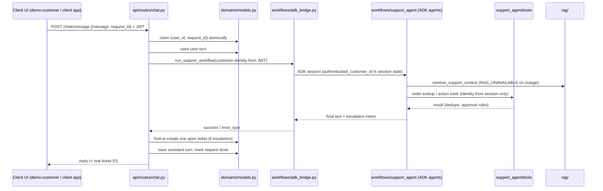

# Architecture

## Request flow

## Layers

| Layer | Package | Rule |
|---|---|---|
| HTTP | `backend/app/api/routes`, `backend/app/api/schemas.py` | Validates input, applies auth dependencies, orchestrates; no business rules |
| Core | `backend/app/core` | `config` (the only `.env` loader and path source), `security` (JWT, bcrypt), `deps` (role checks) |
| Domain data | `backend/app/domains` | All MongoDB reads/writes for users, conversations, tickets, chat requests |
| Workflow | `backend/app/workflows` | `adk_bridge` runs the ADK graph; `support_agent` holds agents, callbacks, guardrails, tools |
| RAG | `backend/app/rag` | Ingest, chunk, embed, retrieve; chunk IDs are `{document_id}:{i}` |
| Infrastructure | `backend/app/infrastructure` | Mongo client; single-process file-backed fallback |

## Trust boundaries

- Customer identity comes from the JWT and is written into the ADK session by the backend. No tool accepts a customer ID argument.
- Model output is untrusted: ticket IDs are minted by the backend; the model only records escalation intent.
- Money rules are code: refunds and replacements on delivered orders always need human approval; duplicates return the existing action.
- Retrieved document text is reference material, never instructions.

## Design decisions

- MongoDB stores the customer-visible transcript; the ADK session service stores agent state and events. They serve different purposes.
- MongoDB is the ticket system of record.
- Chroma is embedded to avoid a separate vector service for local use.
- Gemini embeddings reuse the existing `google-genai` dependency.
- Routes are not URL-versioned yet (`/chat/message`, not `/v1/...`). Add a version prefix when the external client API (Task 2) ships.
